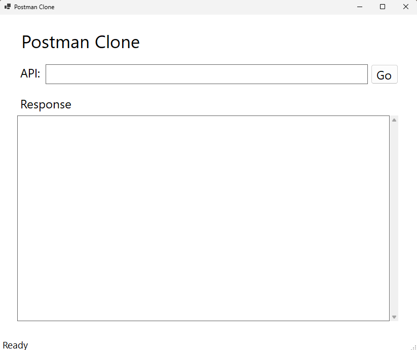
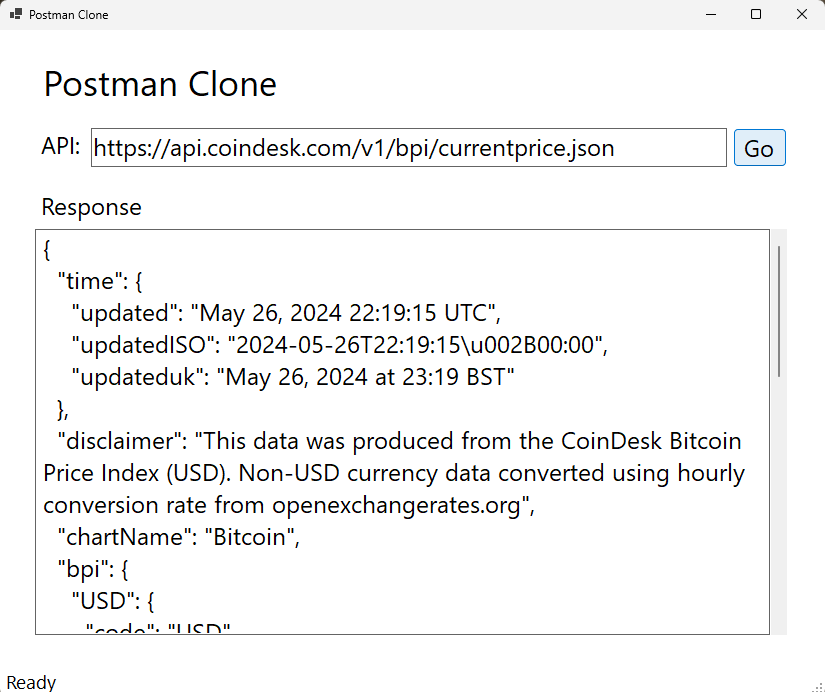

# Postman Clone
Postman Clone provides a user-friendly interface for making GET requests to APIs and viewing the responses in formatted JSON. Ideal for developers and testers, this tool simpifies API interaction and debugging, helping you efficiently validate and troublishhot you API calls.

## Technologies Used
* C#
* .Net 8
* Winforms
* HttpClient

## Using The App
1. Download the executable file from the release section.
2. When the application launches, it should look like this:

3. Fill in you API URL and hit Go:

## Upcoming Changes
* Adding POST, PUTL, PATCH, and DELETE functionality
* Adding API headers
* Handling API authentication
* Adding Dependency Injection
* Adding Logging
* Create a web-based user interface for the application
